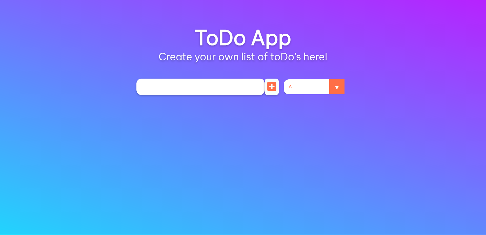
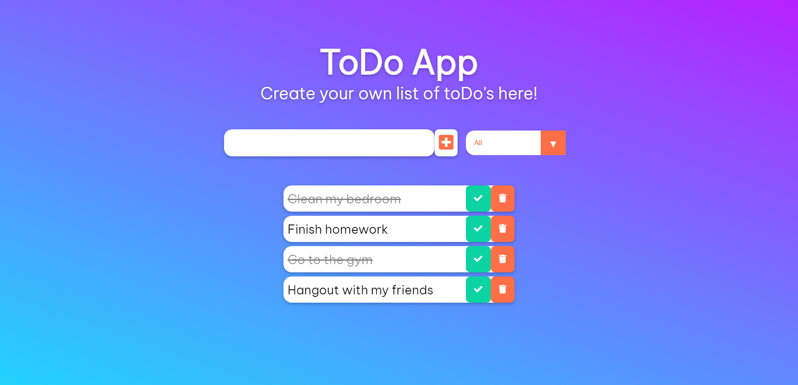
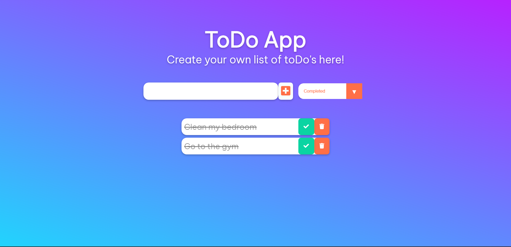

# TodoList React App
This is a TodoList app powered by HTML, CSS and React JS created following a [Dev Ed](https://www.youtube.com/c/DevEd) tutorial video for React beginners.

## Features
- Registers the tasks into an organized list.
- Creates a list of every task finished or unfinished.
- Allows to change the status of every individual task into completed or incompleted.
- Allows to filter the list of shown tasks with the status.
- Simple intuitive design.

## Screenshots

Thank you! :relaxed:
